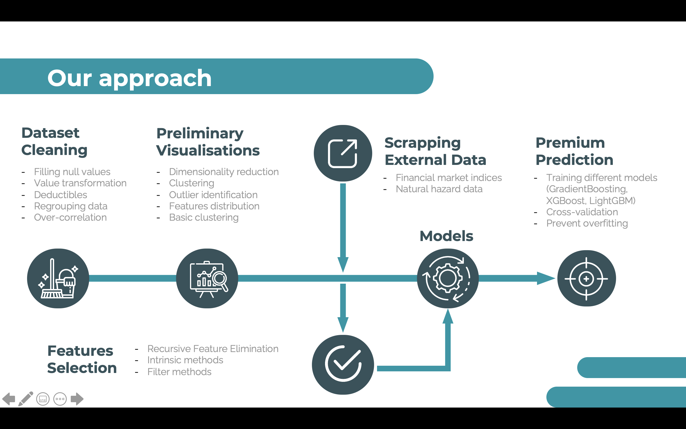
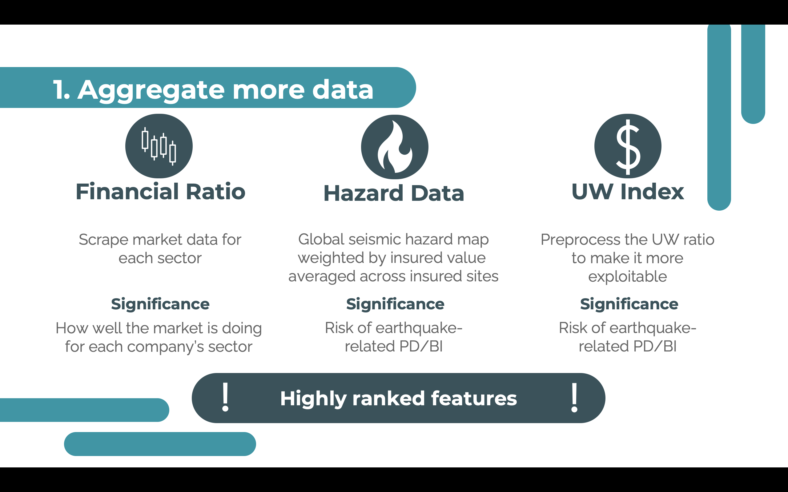
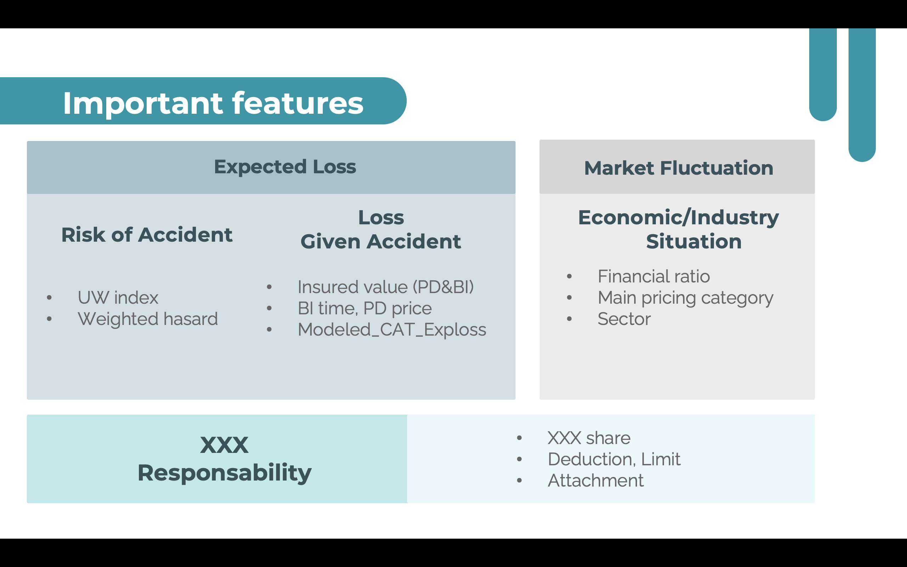
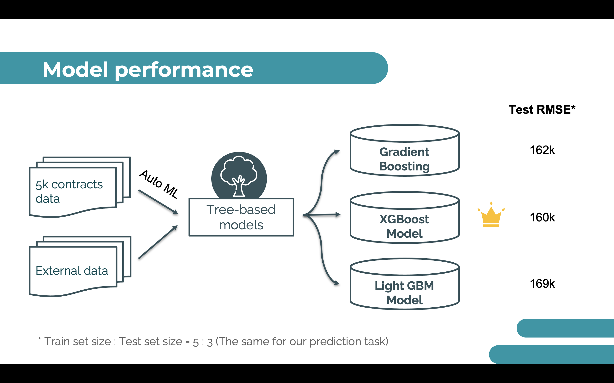

# Predict_Premium_Datathon

This was a team submission for a datathon.

The aim is to predict market premium of reinsurance contract.

The full explanation of the business context and report can be found in the file *Presentation.pptx*. Datasets have been removed for confidentiality reason.

